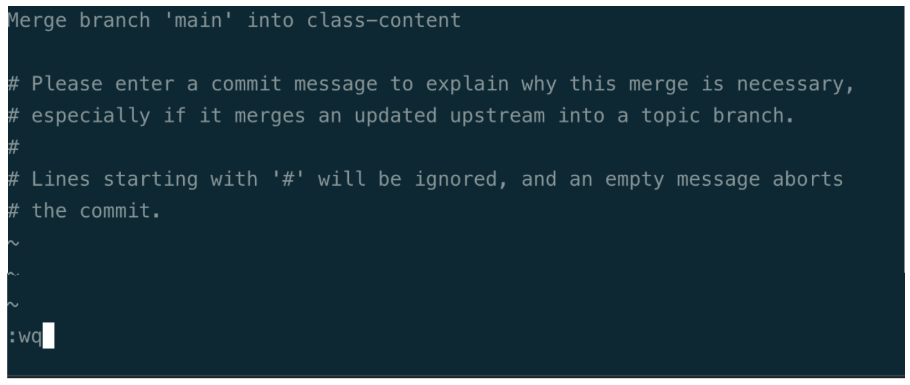

# 00 - week 1 git flow

Each week we will push up lessons and solutions. We want you to keep all of the code on your own git branch.

## SSH KEYS

1. Add `ssh keys` to GitLab and GitHub. Please regenerate the ssh keys without a passphrase. 

## DIRECTORY STRUCTURE SET UP

Here’s the set up you do in week 1:

1. Create folder structure

    a. `mkdir bootcamp`

    b. `cd bootcamp`

    c. `mkdir playground`

    d. `mkdir homework`

    e. clone curriculum  - `git clone git@git.bootcampcontent.com:Northwestern-University/NU-VIRT-FSF-PT-07-2023-U-LOLC.git`
    

## CREATE YOUR WORKING GIT BRANCH (only once)

1. cd `NU-VIRT-FSF-PT-07-2023-U-LOLC` you will be on a branch called `main`. If the branch you are on is not `main`, checkout to main, `git checkout main`. This means that `main` branch already exists. 

2. `git pull` - this will fetch code that is in the GitLab cloud.

3. Create a branch where you will keep all your classtime work - `git checkout -b <branch name>`. Notice the `-b`. This means you are creating a new branch.
    a. Example: `git checkout -b class-content`

4. At the end of class add your work to the class-content branch

    a. `git add -A`

    b. `git commit -m "week 1 exercises"` - What you put in the quotes explains what work you completed”

## WEEKLY/BEFORE EACH CLASS PULLING CURRICULUM

**Here’s the process:**

1.  You are likely starting on your `class-content` branch. Check the status of branch by typing `git status`. This will show which files you modified. If you have a list of files that you've edited, add and commit your changes on this branch. 

    a.  `git add -A`

    b.  `git commit -m "message of what work was done"`
    
2. checkout to branch `main`

    a. `git checkout main`

    b. `git pull` - you will get all the current curriculum and solutions. `main` will be updated.

3. checkout to branch `class-content`

    a.  `git checkout class-content` -  check out to your class branch

    b. `git merge main`- merge the content that is on `main` with your `class-content` branch.

    e. You may see a a screen that looks like this. When you do, type `:wq`. If successful, you will be returned to your terminal. If not, you are using vim and you should press the `esc` button and start over or reach out for help.
    

4. You should be all done and ready for class.
